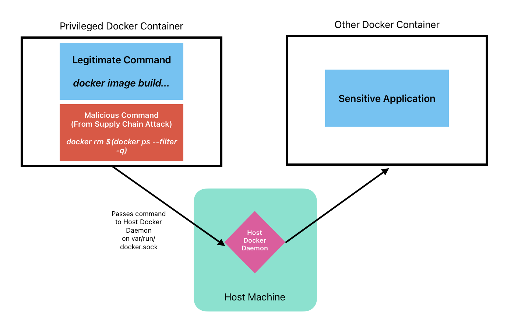

[//]: # (Implicit Links Within Project)

[1]: https://docs.gitlab.com/ee/ci/docker/using_kaniko.html   "GitLab Kaniko Docs"
[2]: https://dev.to/ipo/using-kaniko-to-build-and-publish-container-image-with-github-action-on-github-self-hosted-runners-d5m   "Rollson Article"
[3]: https://github.com/GoogleContainerTools/kaniko   "Google Container Tools"
[4]: https://madhuakula.com/kubernetes-goat/docs/scenarios/scenario-2/docker-in-docker-exploitation-in-kubernetes-containers/   "KubeGoat"
[5]: https://owasp.org/www-project-kubernetes-top-ten/   "OWASP Kubernetes Top 10"
[6]: https://docs.github.com/en/actions/using-workflows/workflow-syntax-for-github-actions#on   "GitHub Actions ON reference"
[7]: https://csrc.nist.gov/pubs/sp/800/190/final "NIST SP 800-190 Specification"

# Kaniko Builds on GitHub Actions

__Updated 9th July 2024__

This directory contains a sample pipeline to securely push docker images to GitHub Container Registry.

It uses three technologies:

- Kaniko, a container building tool by Google.
- Trivy, by Aquasec, an Open-Source Vulnerability Scanner.
- Crane, a container push tool by Google.

## Table of Contents

- [Kaniko Builds on GitHub Actions](#kaniko-builds-on-github-actions)
  - [Table of Contents](#table-of-contents)
  - [Container Building](#container-building)
    - [What's the Problem?](#whats-the-problem)
    - [What is Kaniko?](#what-is-kaniko)
  - [Vulnerability Scanning](#vulnerability-scanning)
    - [Trivy](#trivy)
  - [Installation and Usage](#installation-and-usage)
    - [Modifying this Action](#modifying-this-action)
  - [Future Improvements](#future-improvements)
  - [Authors](#authors)


## Container Building

### What's the Problem?

[Kubernetes OWASP Top 10][5] states that DIND is 'K01' - The top cause of Kubernetes exploitation. In this example repository, we want to build a docker image inside of another docker image. This is called running 'Docker in Docker' or 'DIND'. A docker container *cannot* run it's own Docker Daemon, instead, it must hook into the parent Daemon via a UNIX socket.



Building an image using the Docker Daemon requires privileged access to it - You may have come across this before in another guise when running Docker on Linux, requiring the addition of a Docker User to the SUDOERS file.

We often build docker containers from other public images, or build docker containers with software packages taken from external sources. If a malicious attacker manages to infiltrate the supply chain of our own software's dependencies, there is a strong chance that they will target the privileged `/var/run/docker.sock` socket - It's privileged, and can do a lot of damage, from stealing intellectual property, to exploit propegation, even escaping the host system.

Madhu Akula has written an amazing series of articles explaining Kubernetes issues in detail, and I would recommend taking the time to [follow this tutorial through][4], just to see how *scary* and *straightforward* it is for a rogue package to exploit a UNIX socket misconfiguration and escape the host system to view other containers.

The most commonly starred GitHub Action for building Docker Images utilises Moby BuildKit and QEMU to address the above issue, and this functionality is obscured to a user over layers of dependent composite actions. Instead, we will use Kaniko to simplify the process of building Docker images.

### What is Kaniko?

[Kaniko][3] is a tool written by Google (though not *officially* supported commercially), which utilises Linux userspace to execute each of the commands inside of a Docker container, rather than the host system itself. It is widely recommended for use on the [GitLab platform][1], but not on GitHub.

This repository utilises [Rollson's Medium Article][2] to build an example Docker Image using Kaniko on GitHub Actions, on every push to the 'main' branch.

## Vulnerability Scanning

NIST [Special Publication 800-190][7] provides a number of recommendations for securely containerising applications. Trivy is an Open Source Container Security tool by Aquasec which can be used to address a number of these:

- Image Vulnerabilities
- Image Configuration Defects
- Embedded Cleartext Secrets

### Trivy

Trivy offers solutions to the above through it's ability to 'scan' files and file metadata. It also offers additional features, such as licence verification and the generation of reports which can be uploaded to GitHub in 'Serif' format.

In this repository, we build the Trivy scanning mechanisms by hand, rather than relying on third-party actions.

## Installation and Usage

First, copy the .github/workflows directory, as well as it's contents, to your own repository.

Configure the two 'env' values according to the Dockerfile you would like to build:

```yaml
env:
  IMAGE_NAME: <your-kaniko-image>  # The name of the image, to be written to GHCR as.
  DOCKERFILE_PATH: path/to/Dockerfile  # The path to your Dockerfile, in relation to the root directory of this repository.
```

After making a push to your 'main' branch, after making a change to either the Dockerfile or the GitHub workflow, a new image will build.


In the homepage of your GitHub repository, look in the right-hand menu bar for the `Releases` tab. You should see your new image.

### Modifying this Action

Our Docker image will only build on a push to the `main` branch. To alter this behaviour, you can edit the `on` statement. Find out more about the 'on' action reference [here.][6]

```yaml
on:
  push:
    branches:
      - "main"
    paths:
      - "Dockerfile"
      - ".github/workflows/**"
```

## Future Improvements

- A more advanced Dockerfile example, rather than just a plain Python image.
- Use Trivy to scan our Docker Image before pushing it to GHCR with Crane.
- Use Trivy to run SAST on our Dockerfile for misconfigurations.
- Use renovatebot to detect version changes to base Docker images.
- Create both ARM and x86-64 Images.
- Incorperate Private runners with runs-on.com.

## Authors

**Josh Higginson** - _Technical Platforms Lead_